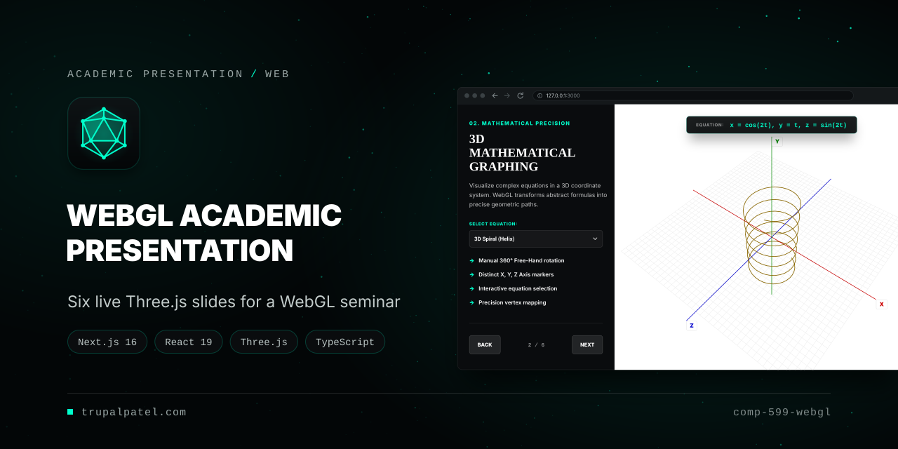
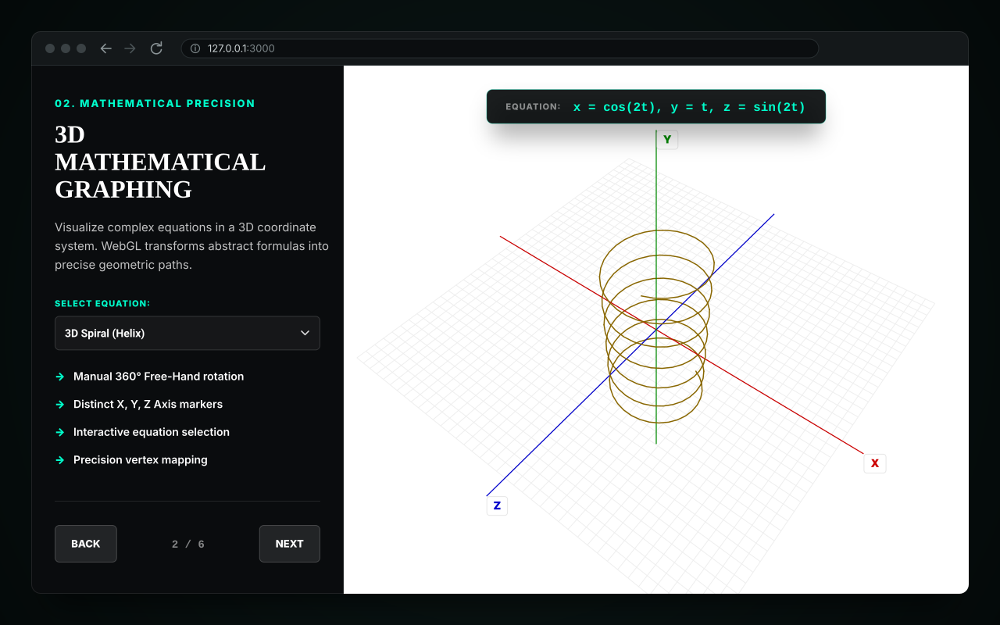
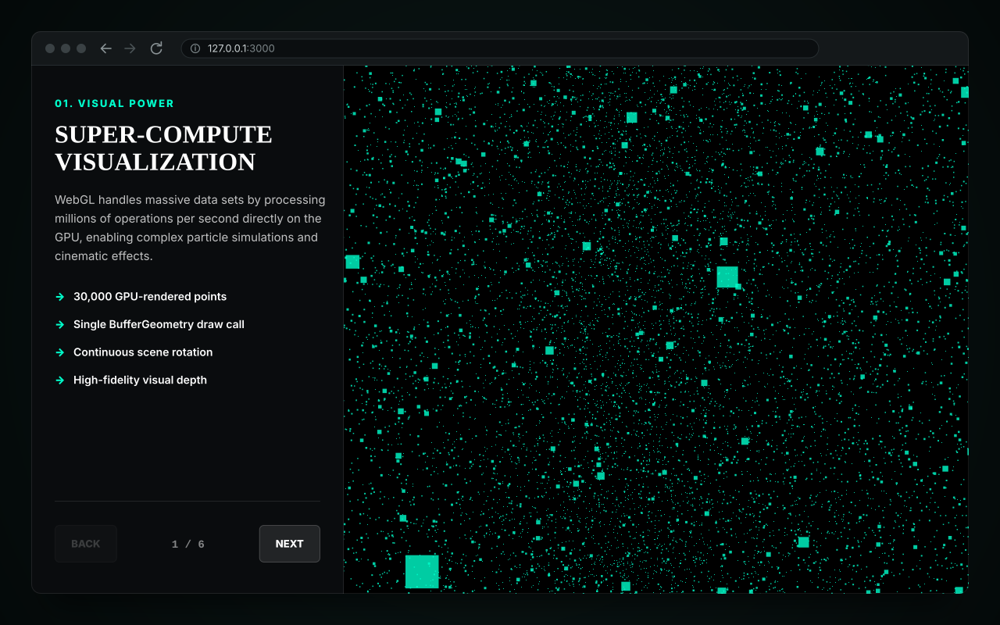
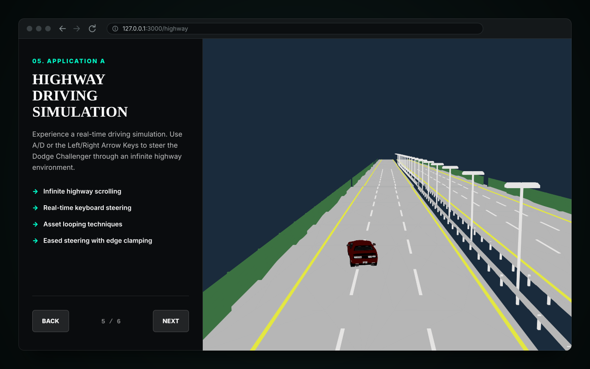
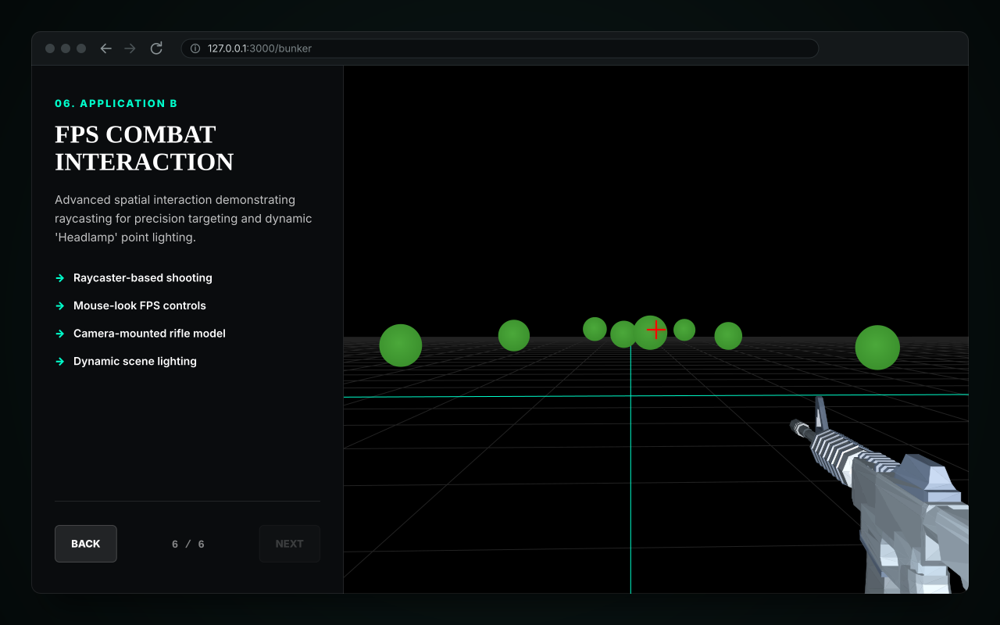
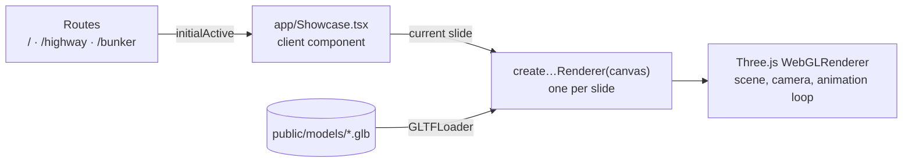

<p align="center">
  
</p>

<p align="center"><strong>A six-slide presentation that runs in the browser: each slide pairs talking points with a live Three.js scene, built for a graduate seminar on 3D visualization on the web.</strong></p>

<p align="center">
  <a href="https://trupalpatel.com/projects/comp-599-webgl"></a>
  
  
  
  
</p>

<p align="center">
  <a href="https://trupalpatel.com/projects/comp-599-webgl"><strong>Case study</strong></a> ·
  <a href="https://trupalpatel.com"><strong>Portfolio</strong></a>
</p>

---

## Overview

Slides about WebGL are more convincing when the slides themselves are WebGL. This project is the live half of a COMP 599 seminar presentation that reviewed research on browser-based 3D visualization. It is a Next.js page laid out like a slide deck: a sidebar carries each slide's points, and beside it a full-height canvas runs that slide's Three.js scene, from a 30,000-point cloud to a small driving demo and a target-practice scene. The seminar paper and the slide deck that go with it live in `docs/`.

The papers reviewed:

1. A. Yuniarti, A. Atminanto, A. Mardasatria, R. R. Hariadi and N. Suciati, "3D ITS Campus on the Web: A WebGL Implementation," 2015.
2. R. Miao, J. Song and Y. Zhu, "3D Geographic Scenes Visualization Based on WebGL," 2017.
3. Y. Yang, "Design of a 2D and 3D Situation Display Platform Based on WebGL and Modern Web Technology Stack," 2024.

## Features

- **Slide deck with live scenes**: six slides, each with a kicker, title, notes and bullets beside a WebGL canvas, with Back / Next and an `n / 6` counter. Every slide change disposes the old renderer and builds the next one.
- **GPU point cloud** (slide 1): 30,000 points in a single `BufferGeometry`, rotating slowly in a 40-unit cube.
- **3D equation plotter** (slide 2): five equations (2D sine, 2D cosine, 3D helix, 3D sine ripple, 3-axis orbit) on a grid with red, green and blue axes, X/Y/Z labels projected every frame, an equation legend, and OrbitControls (drag to rotate, scroll to zoom).
- **Icosphere point cloud** (slide 3): an `IcosahedronGeometry` rendered as points for the CPU vs GPU discussion.
- **GLB asset loading** (slide 4): a Dodge Challenger model loaded with `GLTFLoader`, centred from its bounding box, and spun.
- **Highway driving** (slide 5, `/highway`): highway tiles loop toward the camera while you steer the car with A/D or the arrow keys, with eased movement clamped to the carriageway.
- **FPS target practice** (slide 6, `/bunker`): mouse-look, a camera-mounted rifle, a headlamp point light, and raycast hits from the crosshair that shrink and respawn eight green targets.
- **Direct links**: `/highway` and `/bunker` open straight on their slide, for jumping to a demo mid-talk.

## Screenshots

<table>
  <tr>
    <td align="center" width="50%">
      
      <br /><sub><b>3D Mathematical Graphing</b>: the helix picked from the equation list</sub>
    </td>
    <td align="center" width="50%">
      
      <br /><sub><b>Super-Compute Visualization</b>: 30,000 GPU-rendered points</sub>
    </td>
  </tr>
  <tr>
    <td align="center" width="50%">
      
      <br /><sub><b>Highway Driving Simulation</b>: steering with A/D at <code>/highway</code></sub>
    </td>
    <td align="center" width="50%">
      
      <br /><sub><b>FPS Combat Interaction</b>: mouse-look and raycast targeting at <code>/bunker</code></sub>
    </td>
  </tr>
</table>

<sub>Screens are SVG recreations of the running app. Each stage is a vector render of that slide's Three.js scene.</sub>

## Architecture



Each route renders the same `Showcase` component with the slide to open on. `Showcase` keeps the current slide in state, and an effect calls that slide's renderer factory with the canvas. The factory sets up its scene, camera and listeners, runs its animation loop, and returns a cleanup function that the effect calls before the next slide starts.

## Tech stack

| Layer | Technology |
|---|---|
| App | Next.js 16 (App Router), React 19 |
| 3D | Three.js 0.184 (`WebGLRenderer`, `GLTFLoader`, `OrbitControls`) |
| Language | TypeScript 6 (strict) |
| Styling | Plain CSS (`app/globals.css`) |
| Tooling | npm (`package-lock.json`) |

## Getting started

### Prerequisites

- Node.js 20.9 or newer (required by Next.js 16)
- npm
- A browser with WebGL enabled

### Install

```bash
git clone https://github.com/TRUPALIX9/comp-599-webgl.git
cd comp-599-webgl
npm ci
```

### Run

```bash
npm run dev
```

Open http://127.0.0.1:3000 for the deck, or http://127.0.0.1:3000/highway and http://127.0.0.1:3000/bunker to start on a demo slide.

Other scripts:

```bash
npm run typecheck   # tsc --noEmit
npm run build       # production build (includes type checking)
npm run start       # serve the production build on 127.0.0.1
```

### Controls

| Slide | Input | Action |
|---|---|---|
| All | Back / Next | Change slide |
| 2 | Select Equation | Switch the plotted equation |
| 2 | Drag / scroll on the canvas | Orbit / zoom the graph |
| 5 | A or Left, D or Right | Steer the car |
| 6 | Move the mouse over the canvas | Look around |
| 6 | Click the canvas | Fire at whatever is under the crosshair |

## Project structure

```text
comp-599-webgl/
├── app/
│   ├── Showcase.tsx       # the deck: SLIDES, EQUATIONS and one Three.js renderer per slide
│   ├── page.tsx           # /          (opens on slide 1)
│   ├── highway/page.tsx   # /highway   (opens on slide 5)
│   ├── bunker/page.tsx    # /bunker    (opens on slide 6)
│   ├── layout.tsx         # page title and metadata
│   └── globals.css        # slide layout, sidebar, legend, axis labels, crosshair
├── public/models/         # 18 GLB models; the slides load the Challenger, the highway and the rifle
├── models/                # source asset archive (not used by the app)
├── docs/                  # seminar paper (.docx), presentation deck (.pptx), README assets
├── references/            # the three papers reviewed (PDF)
└── next.config.mjs        # Next.js config (response headers)
```

The GLB models in `public/models/` and the papers in `references/` are third-party material. Their sources and licences are not recorded in this repository.

## Author

**Trupal Patel**

<p>
  <a href="https://trupalpatel.com">Portfolio</a> ·
  <a href="mailto:trupal.work@gmail.com">trupal.work@gmail.com</a> ·
  <a href="https://www.linkedin.com/in/trupalix">LinkedIn</a> ·
  <a href="https://github.com/TRUPALIX9">GitHub</a>
</p>
